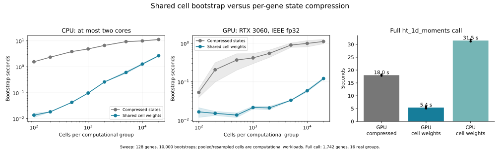

# Shared cell bootstrap: CPU and GPU results

Shared cell weights reduce the full GPU `ht_1d_moments` call from **17.8–18.2 s
to 5.1–5.7 s**, about **3.3x** using the average timings. The corresponding
experimental CPU implementation completes in **31.1–31.9 s** with two CPUs.

The expected crossover depends strongly on the number of genes sharing weights.
With 128 genes, cell sampling wins throughout the tested 100–20,000-cell range
on both devices. For one median-expression gene at 20,000 cells, compression wins
on both devices. There is no universal threshold based only on cell count.



## Algorithm and estimator

For each biological group, each bootstrap replicate draws `n` cell indices
uniformly with replacement. Their occurrence counts form a `B x n` weight
matrix `W`; every row sums exactly to `n`. Sampling storage has no gene dimension.
CPU generation uses integer indices and `bincount`; GPU generation uses integer
indices and `scatter_add_`. Draws are generated in chunks of 512 replicates.

The per-cell, per-gene coefficients use the same fixed approximate size factors
and capture rates as the existing bootstrap:

```
A[cell, gene] = expression / size_factor
C[cell, gene] = (expression**2 - (1-q)*expression) / size_factor**2
mean = W @ A / n
variance = W @ C / n - mean**2
```

The implementation concatenates `A` and `C` and uses one matrix multiplication.
In the full call, a group's `W` is generated once and retained across outer gene
batches. The same cell resampling therefore applies across all genes. Marginal
gene-level bootstrap distributions are preserved; the cross-gene dependence of
the random draws changes relative to independent per-gene sampling. This work
does not implement or validate the 2D correlation pipeline.

Size factors are not refitted in a bootstrap replicate. Their existing binning
is retained; this experiment bypasses expression/size-factor state compression,
not size-factor normalization. Original mean/variance fits, invalid-group masks,
residual-variance transforms, invalid-draw replacement, and regression semantics
are retained. CPU invalid-draw replacement uses memento's existing `_fill`.

## Full real-data call

CD14+ Monocytes: 5,341 cells, 16 donor/condition groups (112–778 cells each),
1,742 eligible genes, 10,000 bootstrap replicates. Capture rate 0.07, paired
donor design, normal ASL, no replicate resampling. Outer gene batch 256.
Dataset loading and initial normalization/fitting are excluded. Task assembly,
transfers, coefficient preparation, sampling, transforms and regression are
included. Each call generates fresh weights; no weights persist between calls.

| Implementation | Complete call | Peak live GPU tensors |
|---|---:|---:|
| GPU compressed states, GPU preparation/regression | 18.216, 17.806 s | 1.636 GiB |
| GPU shared cell weights, GPU regression | 5.081, 5.704 s | 1.786 GiB |
| CPU shared cell weights, CPU regression | 31.137, 31.851 s | Not applicable |

Full-call GPU matrix timings are bracketed by compressed runs in the same
process. Final CPU results are in the separate CPU report. The initial report
also contains a superseded 64.4-second CPU prototype that used GPU-oriented
search-based invalid-draw filling; that timing is excluded from the table.
Reusing the existing CPU filling helper avoids that unnecessary CPU cost.

On GPU, shared weight generation takes **0.048–0.063 s** and matrix-based moment
calculation takes **0.232–0.253 s**. The previous compressed sampling stage takes
**12.84–12.94 s**. Preparation, transforms, regression and wrapper overhead now
dominate the complete call. The cell-weight cache occupies about **204 MiB**
across all real groups; this is a useful allocation without filling the card.

CPU weight generation takes 0.28–0.31 s, moment calculation 7.39–7.52 s,
transforms 14.26–14.40 s and regression 5.89–6.23 s. We did not run the original
CPU package on all 1,742 genes in this experiment, so the full-call CPU timing
does not establish a same-workload speedup over that backend. The bootstrap-only
comparisons below directly test the CPU algorithm change.

## Group-size sweep

128 genes selected across the expression range, 10,000 replicates. Timings
include state/coefficients preparation and weight generation, but exclude
regression and post-bootstrap transforms. Two trials reverse mode order;
entries below are medians. CPU compression calls the existing `_bootstrap_1d`
with two worker threads. CPU matrix multiplication uses up to two BLAS threads.
GPU compression uses GPU state preparation, state-count buckets and the existing
conditional-binomial sampler. Matrix weights are streamed in 512-replicate
chunks, so large groups do not require retaining all `B x n` weights at once.

| Cells | CPU compressed | CPU matrix | GPU compressed | GPU matrix |
|---:|---:|---:|---:|---:|
| 100 | 1.566 s | 0.014 s | 0.053 s | 0.017 s |
| 200 | 2.356 s | 0.018 s | 0.206 s | 0.015 s |
| 500 | 3.867 s | 0.043 s | 0.368 s | 0.014 s |
| 1,000 | 4.887 s | 0.098 s | 0.418 s | 0.021 s |
| 2,000 | 6.678 s | 0.261 s | 0.548 s | 0.021 s |
| 5,000 | 9.340 s | 0.606 s | 0.900 s | 0.033 s |
| 10,000 | 9.958 s | 1.276 s | 0.994 s | 0.058 s |
| 20,000 | 11.307 s | 2.666 s | 1.115 s | 0.122 s |

These are computational workloads drawn from the pooled CD14+ cells, not
biological tests on pooled donors. Up to 5,341 cells, sampling is without
replacement; larger workloads sample source cells with replacement. This limits
new state diversity as cell count grows. The experiment does not establish a
crossover for other datasets or arbitrarily large groups. State counts and
individual timings are recorded, including substantial variation in some short
GPU compressed timings. The full pipeline batches states across groups, whereas
this sweep benchmarks one group at a time.

### Removing cross-gene amortization

A follow-up uses one median-expression gene. At 20,000 cells it has 102 states:

| Device | Compressed | Shared cell matrix |
|---|---:|---:|
| CPU | 0.098 s | 2.106 s |
| GPU | 0.016 s | 0.054 s |

For that single gene, CPU compression already wins at 2,000 cells (0.072 versus
0.156 s); GPU times there are about equal (both 0.012 s). At 100 cells, CPU
matrix sampling wins, while GPU compression has a small advantage. These points
demonstrate why gene count, state diversity and device all matter alongside `n`.

### Matched-precision CPU control

The main matrix runs use fp32 coefficients/accumulation, while the original CPU
bootstrap uses fp64. An additional CPU control uses fp64 matrix multiplication
and weights to distinguish the algorithm change from precision effects:

| Cells, 128 genes | CPU compressed fp64 | CPU matrix fp64 |
|---|---:|---:|
| 100 | 1.562 s | 0.027 s |
| 5,000 | 9.614 s | 0.801 s |

The substantial CPU benefit remains at matched precision. The 5,000-cell control
uses a separately selected pool subset, so its timings should be compared within
this table. The GPU runs use ordinary fp32 GEMM with TF32 disabled; no fp16 or
reduced-mantissa matrix multiplication is used.

## Correctness and regression checks

- CPU and GPU weight generation pass exact count conservation, integer and
  nonnegativity checks. A seven-cell, 100,000-replicate test checks expected
  means and multinomial covariance, including negative off-diagonal covariance.
- On the smallest and largest real groups, identical cell weights are aggregated
  into each gene's exact compressed states. The resulting original estimator
  agrees with direct fp64 matrix moments (mean tolerance 2e-12, variance 2e-11,
  plus 1e-12 absolute tolerance).
- Relative to those fixed-weight fp64 moments, maximum fp32 variance error
  scaled by `abs(variance) + mean**2` is **1.12e-6** on CPU and **4.93e-7** on GPU.
  This scaling avoids a misleading relative error near zero variance.
- Independent compressed-CPU versus shared-cell-GPU runs at 40,000 replicates
  give mean/variance bootstrap SD ratios between **0.988 and 1.010** across the
  tested 16 genes in each real group. The prespecified per-gene tolerance is 5%.
- On 32 real genes with 2,000 replicates, CPU and GPU regressions applied to
  identical shared-cell bootstrap inputs agree with the original CPU regression
  to maximum absolute error below **2.8e-14**. This also passes after replacing
  CPU filling with the package helper. Validation time is excluded from the
  performance runs above.
- All full-call summaries are finite. Across final CPU/GPU cell-weight runs,
  median SE ratios versus compressed sampling are about **0.9987–1.0013**.
  Central 90% intervals are roughly 0.981–1.021, similar to the independent
  compressed-repeat control. Coefficient differences at the 95th percentile are
  about 0.03 reference SE, also similar to the repeat control. Individual draws
  and p-values are not expected to match across independent random runs.

The input-sharing proof and fixed-weight arithmetic checks are stronger evidence
of estimator equivalence than agreement of a few summary ratios alone. They do
not establish correctness of a future correlation implementation or guarantee
identical cross-gene Monte Carlo behavior.

## Scope, resources and next use

Everything remains under `experimental/gpu_acceleration`; package defaults and
dependencies are unchanged. The experiment uses the existing torch environment
and RTX 3060. CPU affinity is restricted to two logical CPUs for every runner;
numerical libraries use at most two threads. Compute experiments run sequentially.
Timing is under workstation load, not isolated hardware conditions.

The current full-call prototype caches every group's cell weights for one call.
The measured dataset fits easily; a general backend would need a workspace policy
for much larger group totals. Streaming is already used in the group-size sweep.
No automatic dispatch threshold is implemented. For this many-gene workload,
shared weights are the preferred experimental path; compression remains useful
when few genes can share the sampling cost.

## Reproduce and artifacts

```bash
conda activate torch
python experimental/gpu_acceleration/bench_cell_matmul.py --phase validate
python experimental/gpu_acceleration/bench_cell_matmul.py --phase full \
  --genes 32 --boots 2000 --batch 32 --validate \
  --out experimental/gpu_acceleration/results_cell_matmul_smoke
python experimental/gpu_acceleration/bench_cell_matmul.py --phase full
python experimental/gpu_acceleration/bench_cell_matmul.py --phase full \
  --modes cpu_matrix cpu_matrix --out experimental/gpu_acceleration/results_cell_matmul_cpu
python experimental/gpu_acceleration/bench_cell_matmul.py --phase sweep
python experimental/gpu_acceleration/bench_cell_matmul.py --phase sweep \
  --gene-counts 1 --cells 100 2000 20000 \
  --out experimental/gpu_acceleration/results_cell_matmul_single
python experimental/gpu_acceleration/bench_cell_matmul.py --phase sweep \
  --cells 100 5000 --sweep-modes cpu_compressed cpu_matrix cpu_matrix64 \
  --out experimental/gpu_acceleration/results_cell_matmul_fp64
python experimental/gpu_acceleration/analyze_cell_matmul.py
python experimental/gpu_acceleration/plot_cell_matmul.py
```

Reports: [full GPU comparison](results_cell_matmul/full.json),
[final CPU calls](results_cell_matmul_cpu/full.json),
[128-gene sweep](results_cell_matmul/sweep.json),
[single gene](results_cell_matmul_single/sweep.json),
[fp64 CPU control](results_cell_matmul_fp64/sweep.json),
[weight/estimator validation](results_cell_matmul/validation.json),
[regression checks](results_cell_matmul_smoke/full.json),
[final CPU regression check](results_cell_matmul_cpu_check/full.json),
[full output comparisons](results_cell_matmul/accuracy.json).

Standalone plot: [SVG](results_cell_matmul/comparison.svg),
[PNG](results_cell_matmul/comparison.svg).
