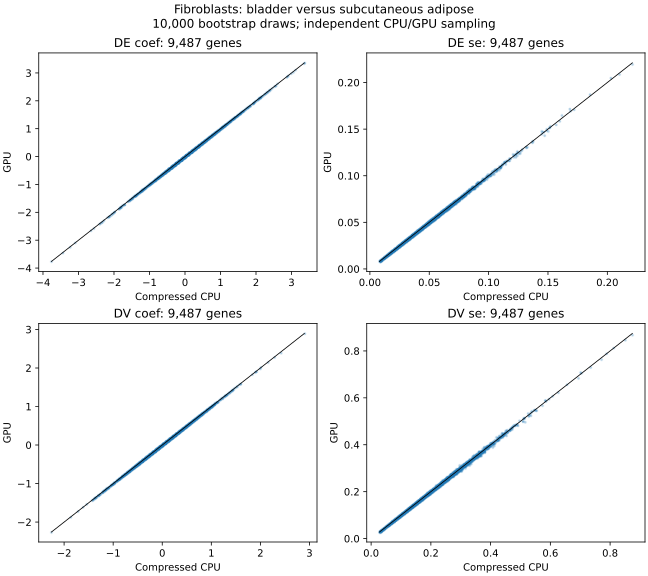

# Fibroblasts: full-panel CPU/GPU validation

Raw integer counts from `ts_stromal.h5ad` (`raw/X`), exact `cell_type="fibroblast"`, 10X only. Bladder is the treatment and subcutaneous adipose the reference. Five donors have at least 30 cells in both tissues: TSP2, TSP14, TSP21, TSP25, TSP27. Groups are donor × tissue; donor indicators are covariates.

There are **17,123 cells and 9,487 tested genes** after the standard filters (`min_perc_group=0.7`). All filtered genes were tested on both backends, with **10,000 draws**, hyper-relative moments, normal ASL, and no donor resampling. Capture rate q=0.07 is an assumed benchmark setting, not a tissue-specific estimate. This validates computational agreement, not biological calibration of that assumption.

| Backend | Seed | Seconds | DE FDR < .05 | DV FDR < .05 |
|---|---:|---:|---:|---:|
| gpu | 5 | 10.88 | 7404 | 1964 |
| gpu | 6 | 10.61 | 7408 | 1972 |
| cpu | 5 | 1332.06 | 7405 | 1967 |

Full CPU/GPU speed ratio: **122.4×** using the first GPU run. CPU uses ten joblib threads with one BLAS thread each; process affinity is CPUs 0–9. Threads avoid ten separate scientific-Python processes in this 8 GiB WSL instance. GPU is an RTX 3060 12 GB with the automatic memory policy; peak live tensor memory **1.72 GiB**. Public-call timings exclude file loading, preprocessing, and result/FDR export. Preparation took 15.49 seconds. These are measurements on this machine, not universal speed claims.

## Agreement

- DE: GPU/CPU SE ratio median **0.9998**, central 90% **0.9833–1.0166**, range 0.9650–1.0407; 0 NaN-SE mismatches. FDR discoveries: 7393 shared, 12 CPU-only, 11 GPU-only.
- DV: GPU/CPU SE ratio median **1.0000**, central 90% **0.9827–1.0173**, range 0.9523–1.0537; 0 NaN-SE mismatches. FDR discoveries: 1955 shared, 12 CPU-only, 9 GPU-only.

Bootstrap draws differ across backends. Borderline calls can differ with Monte Carlo noise; the independent GPU repeat is included in the JSON report. BH correction is performed separately for DE and DV across the full panel. Inference uses the existing cell-bootstrap model conditional on these donors. This experiment covers mean and variability tests, not correlations.



## Reproduce and inspect

```bash
conda activate torch
python experimental/gpu_acceleration/run_fibroblasts.py
python experimental/gpu_acceleration/analyze_fibroblasts.py
```

The runner reads only selected raw-count rows and checkpoints completed backend runs, reusing them after an interruption. Source files are not modified.

- [Full CPU results](results_fibroblasts/cpu_seed5.csv)
- [Full GPU results](results_fibroblasts/gpu_seed5.csv)
- [GPU repeat](results_fibroblasts/gpu_seed6.csv)
- [Donor cell counts and exclusions](results_fibroblasts/donor_cell_counts.csv)
- [Settings, timings and comparisons](results_fibroblasts/report.json)
