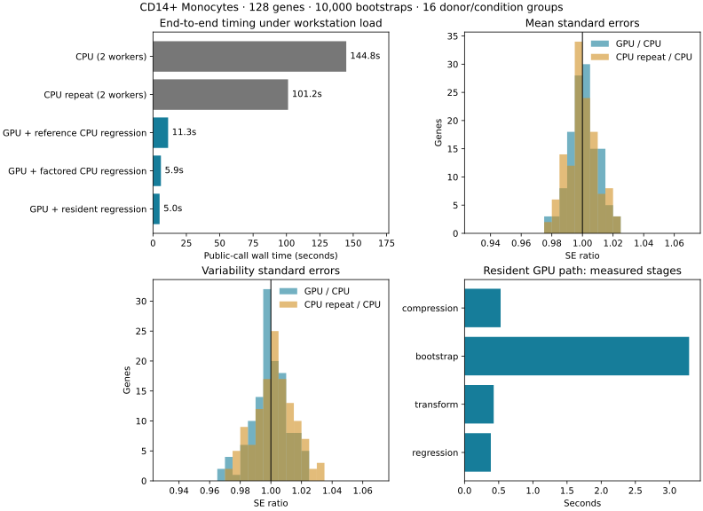

# CD14+ Monocyte GPU experiments — 2026-09-20

The experimental resident GPU path completes a real `ht_1d_moments` call for
1,742 genes and 10,000 bootstrap draws in about 31–32 seconds on the RTX 3060.
On a matched 128-gene comparison, it takes 4.95 seconds versus 101–145 seconds
for the existing two-worker CPU implementation. Accuracy checks support keeping
fp32 sampling/moment accumulation and fp64 transformations/regression.

These are measurements under workstation load, with at most two logical CPU
cores available to the experiment. They are not comparisons against an idle
workstation using all CPU cores. Only the 128-gene subset has a measured CPU
end-to-end baseline; no full-dataset CPU speedup is claimed.

## Setup

Data: `/mnt/c/Data/memento_workspace/interferon_filtered.h5ad`, CD14+ Monocytes
(5,341 cells). Eight donors × two conditions give 16 groups of 112–778 cells.
Test stimulated versus control, adjusting for donor, weighted by group cell
count. Use `q=0.07`, default normalization/filtering, and
`min_perc_group=0.7`. This retains 1,742 genes. The 128-gene comparison samples
evenly across mean-expression rank while retaining normalization and
mean–variance fits from the complete eligible set.

Environment: existing `torch` conda environment, torch 2.9.0+cu128, RTX 3060
12 GB. Scripts enforce affinity to logical CPUs 0 and 1 and one numerical
library thread; the CPU baseline uses two joblib workers. No package source or
dependency changes were made. Implementation, limitations and commands are in
[README.md](README.md).

## Matched end-to-end comparison

128 genes × 16 groups × 10,000 draws. Times include the public call's task
construction, state compression, data transfers, bootstrap, invalid-draw
handling, residual-variance/log transformations, regression and result storage.
Shared setup/normalization and CUDA initialization are excluded. The first CPU
run includes worker startup. Timing variability and startup contribute to the
wide CPU range; these two runs alone cannot separate those effects.

| Execution | Wall time | Regression stage | Peak GPU tensors |
|---|---:|---:|---:|
| CPU, seed 5 | 144.80 s | Not isolated | — |
| CPU, seed 6 | 101.19 s | Not isolated | — |
| GPU bootstrap + existing CPU regression | 11.33 s | 6.63 s | 398 MiB |
| GPU bootstrap + factored CPU regression | 5.94 s | 1.64 s | 509 MiB |
| GPU bootstrap + resident GPU regression | 4.95 s | 0.385 s | 653 MiB |

Against the faster CPU run, the resident path is **20.4× faster**; against the
first run it is 29.2×. Factoring the weighted regression into a small design
map accounts for much of the improvement over the original regression.
Keeping the distributions on the GPU provides an additional benefit.

Raw measurements: [128-gene report](results/report_128g_10000b.json).

## Correctness

- **Same bootstrap inputs, actual data:** existing CPU and resident GPU
  regression agree to a maximum absolute difference of `3.08e-14` across all
  six output arrays in the 128-gene comparison. The factored CPU path also
  passes `rtol=2e-7, atol=2e-10` against the resident GPU outputs.
- **Independent random draws:** median GPU/CPU SE ratios are 1.0006 for mean
  and 0.9995 for variability. Their 5th–95th percentile intervals are
  [0.9851, 1.0175] and [0.9786, 1.0179]. CPU-repeat/CPU intervals are
  [0.9840, 1.0170] and [0.9803, 1.0227]. This is consistent with ordinary Monte
  Carlo variation, rather than a systematic GPU scale error.
- **Coefficients and p-values:** CPU/GPU coefficient differences have medians
  of 0.0088 and 0.0097 reference SEs for mean and variability. Maximum absolute
  p-value differences are 0.0084 and 0.0171; CPU-repeat maxima are 0.0092 and
  0.0188. No NaN-pattern disagreements occurred.
- **Sampler:** 100,000-draw synthetic checks pass exact count conservation,
  marginal means/variances, negative off-diagonal covariances, one-state rows,
  and unequal-length padding. GPU/CPU bootstrap SD ratios are 0.996–1.006.
- **Real-state precision:** eight gene/group cases spanning the smallest and
  largest donor groups and 24–680 states, with 40,000 draws each, pass count
  conservation and SD-ratio checks. Observed SD ratios range from 0.994 to
  1.011. Against fp64 accumulation of identical sampled counts, maximum mean
  and variance roundoff errors are 0.000105 and 0.000709 bootstrap SDs. No
  variance-sign disagreements occurred. These cases support fp32 accumulation
  here; they do not establish accuracy for every possible dataset.
- **Synthetic regression:** nontrivial covariates, two treatments, missing
  groups and a nonfinite draw match the existing CPU reference within
  `2.22e-16` maximum absolute error.

Raw checks: [validation](results/validation.json),
[full-run finite-output/subset checks](results/full_gene_checks.json).

## Regression precision and timing

On identical real bootstrap inputs for 32 genes and 10,000 draws, median of
three warmed measurements:

| Regression implementation | Time | Maximum absolute output error vs CPU |
|---|---:|---:|
| Existing CPU, including distribution transfer | 1.739 s | Reference |
| Factored CPU, including distribution transfer | 0.394 s | 2.71e-14 |
| Resident GPU fp64 | 0.147 s | 2.70e-14 |
| Resident GPU fp32 | 0.146 s | 1.47e-5 |

There is no useful demonstrated fp32 regression timing advantage at this size;
retain fp64. The small design factorization still runs on CPU; bootstrap-wide
application and summaries run on the selected device. These are comparisons of
complete regression paths including their required transfers, not isolated
CPU/GPU matrix-kernel comparisons. The validation run's overall wall time
includes repeated checks and is not an end-to-end performance result.

Raw measurements: [regression report](results_regression/report_32g_10000b.json).

## All eligible genes and batch size

1,742 genes, all 16 groups, 10,000 draws, resident GPU regression:

| Gene batch | Wall time | Peak GPU tensors | Padded-state fraction |
|---|---:|---:|---:|
| 256 | 32.46 s | 1.51 GiB | 22.7% |
| 1,024 | 30.95 s | 4.82 GiB | 28.1% |

Both runs return finite values for every gene and all six summaries. The
128-gene overlap with the CPU baseline retains SE-ratio medians near one.
Peak tensor memory excludes the CUDA context, allocator reservations, and other
processes' VRAM use.

At batch 1,024, compression takes 5.84 s, bootstrap 17.82 s, transformations
1.79 s, and regression 2.13 s. The remainder includes public-call task assembly
and uninstrumented allocation/dispatch work. Bootstrap timing includes its
coefficient preparation, copies and Python launches, not just device kernels.

The 5% timing improvement from 256 to 1,024 is small relative to workstation
load variation and costs about 3.2× the memory. **Use 256 as the initial
full-workload batch size.** A batch-size ceiling was not established; the
1,742-gene dataset does not provide a 4,096-gene batch. Retained group-wise
distributions and regression temporaries, not just the fused sampler's working
arrays, now determine memory requirements.

**Follow-up:** [repeated batch and sampler-memory experiments](BATCH_RESULTS.md)
also tested all 1,742 genes in one batch. It fits, peaking at 8.70 GiB of live
tensors and 11.24 GiB reserved, but does not beat batch 1,024. Reverse-pass
timings for every gene-batch size converge to about 29 seconds. Increasing the
sampler budget separately shows no clear benefit after checking timing drift.

Raw measurements: [batch 256](results_full256/report_1742g_10000b.json),
[batch 1,024](results_full1024/report_1742g_10000b.json).

The next useful optimization targets are state compression/task construction
and bootstrap launch/bucketing overhead. Further integration should retain
the CPU regression-factorization comparison so that algebraic improvements
are not misattributed entirely to GPU hardware. Correlation remains deferred.
